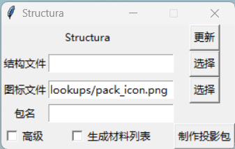
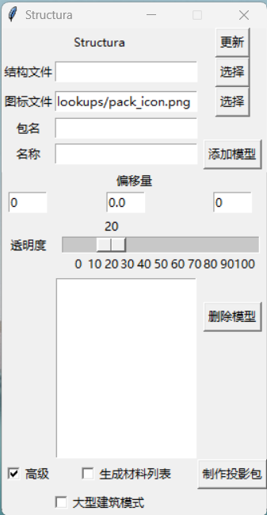
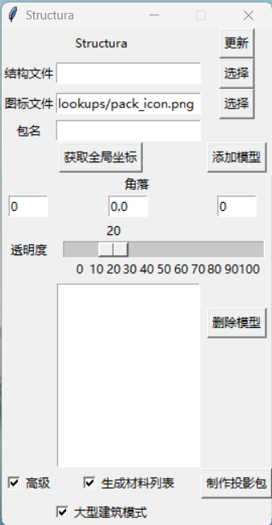

# Structura-Chinese
Structura汉化版，直接修改源码显示文字，[原版地址](https://github.com/RavinMaddHatter/Structura)，[汉化最新版下载地址](https://github.com/TC999/Structura-Chinese/releases/latest)

该软件Wiki(简体中文，非官方)

## 效果展示

普通

高级选项勾选

大型建筑模式（1.6.3新增）

## 翻译文本(Translation)：

|原文|简体中文|繁體中文（香港）|繁體中文（台灣）|
|----|----|----|----|
|Update|更新|更新|更新|
|Structure File|结构文件|||
|Icon File|图标文件|||
|Pack Name|包名|||
|Browse|选择|||
|advanced|高级|||
|make lists|生成材料列表|||
|Make Pack|制作投影包|||
|Offset|偏移量|||
|Transparency|透明度|||
|Add Model|添加模型|||
|Remove Model|删除模型|||
|Big Build Mode|大型建筑模式|||
|Get Global Cords|获取全局坐标|||
## 待办(TODO)

- [x] 材料列表翻译（大部分）

- [ ] 多国语言界面（繁体中文）

- [ ] 向原版提交翻译

## 协助开发

 1. 复刻(Fork)此项目
 2. 在复刻项目中修改 `Structura.py` `\lookups\material_list_names.json` 源码
 3. 提交拉取请求(Pull Request)

## 构建方法（仅Windows，推荐使用[PyCharm社区版](https://www.jetbrains.com/pycharm/download/?section=windows)）
 1. 下载整个项目的代码，并在PyCharm中打开
 2. 配置虚拟环境:`pip install -r requirements.txt` `pip install pyinstaller`
 3. 打包指令`pyinstaller -F -w -i icon.icon structura.py`
 4. 将`lookups`、`Vanilla_Resource_Pack`全部复制到`dist`文件夹中，双击`structura.exe`即可
